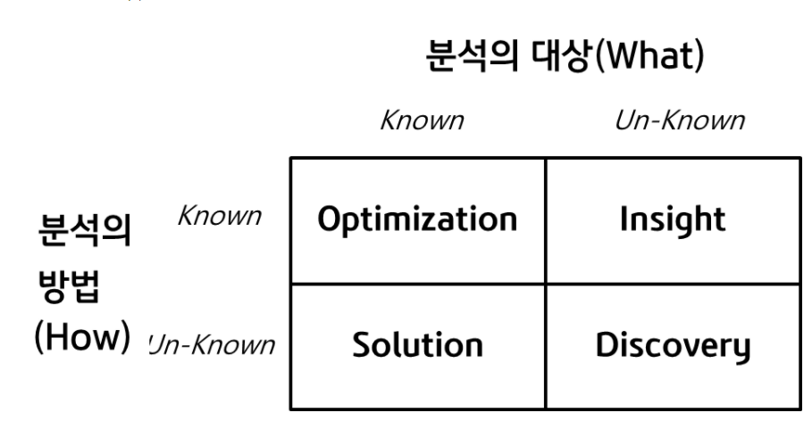
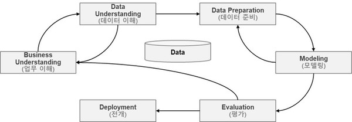
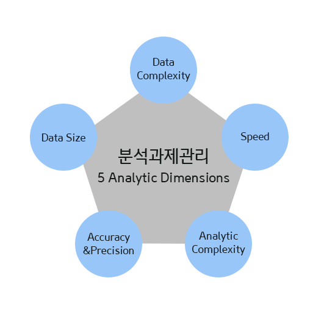

# 1. 데이터 분석 기획의 이해

## 1) 데이터 분석기획 방향성 도출

1. 분석 기획
  - 실제 분석을 수행하기에 앞서, 분석을 수행할 **과제의 정의**에서부터 의도했던 **결과**를 도출하기까지의 과정을 적절하게 관리할 수 있도록 방안을 **사전에 계획**하는 일련의 작업

  - 어떤 목표(What)를 달성하기 위하여(Why) 어떠한 데이터를 가지고 어떤 방식으로(How) 수행할 지에 대한 일련의 계획을 수립하는 작업

2. 분석 대상과 방법

- 

## 2) 분석방법론

### 분석 방법론 개요

- 데이터 분석을 효과적으로 기업내 장착하기 위해서는 데이터 분석 방법론이 필수

- 프로젝트는 한 개인의 역량이나 조직의 우연한 성공에 기인해서는 안되고, 일정한 수준의 품질을 갖춘 산출물과 프로젝트 성공의 가능성을 확보 제시할 수 있어야 함

- 데이터 분석 방법론은 **절차, 방법, 도구와 기법, 템플릿과 산출물**로 구성되어 어느정도 지식만 있으면 활용 가능해야함

### 데이터 기반 의사결정의 필요성

- 경험과 감에 따른 의사결정 -> 데이터 기반의 의사결정
- 기업의 합리적 의사결정을 가로막는 장애요소
  - 고정관념(stereotype)
  - 편향된 생각(Bias)
  - 프레이밍 효과(framing Effect)

### 1. KDD 분석방법론

1. 데이터셋 선택 (Data Selection)
  - 비즈니스 도메인에 대한 프로젝트 목표 설정이 선행 되어야함
  - 원시 데이터에서 필요한 데이터만 추출하는 단계  

2. 데이터 전처리 (Preprocessing)
    - Outlier, Missing Value, Noise 처리  

3. 데이터 변환 (Transformation)
  - dimensionality reduction(차원 축소)
  - Splitting Data(데이터 분리)

4. 데이터 마이닝 (Data Mining)
  - 기법 선택, 알고리즘 적용
  - 전처리와 변환 프로레서 추가 실행하여 최적의 결과 산출

5. 데이터 마이닝 결과 평가 (Interpretation/Evaluation)
  - 목적과 일치하는지, 지식 업무에 활용
  
### 2. CRISP-DM 방법론

- CRISP-DM 방법론은 단계, 일반과제, 세부과제, 프로세스 실행 등의 4가지 레벨로 구성된 계층적 프로세스 모델이다.

- 절차는 6단계로 구성되어 있는데 각 단계들은 순차적으로 진행되는 것이 아니라, 필요에 따라 단계 간의 반복 수행을 통해 분석의 품질을 향상 시킴

- 

1. 업무 이해 (Business Understanding)
  - 업무 목적 파악, 상황파악, 데이터마이닝의 목표설정, 프로젝트 계획수립

2. 데이터 이해 (Data Understanding)
  - 초기 데이터 수집, 데이터 기술분석, EDA, 데이터 품질 확인

3. 데이터 준비 (Data Preparation)
  - 데이터셋의 선택과 데이터 정제, 분석용 데이터셋 편성, 데이터 통합, 데이터 포매팅

4. 모델링 (Modeling)
  - 모델링 기법 선택, 모델 테스트 계획 설계, 모델 작성과 평가

5. 평가 (Evaluation)
  - 분석결과 평가, 모델링 과정 평가, 모델 적용성 평가

6. 전개 (Deployment)
  - 전개 계획 수립 및 모니터링/유지보수 계획수립, 프로젝트 종료 보고서 작성, 프로젝트 리뷰

### 3. 빅데이터 분석 방법론

- 빅데이터 분석 방법론은 계층적 프로세스 모델로 3계층으로 구성
  - 단계 (Phase)
    - 프로세스 그룹을 통하여 완성된 단계별 산출물이 생성됨
    - 각 단계는 기준선으로 설정되어 관리되어야 하며 버전관리 등을 통하여 통제가 이루어져야함

  - 태스크 (Task)
    - 각 단계는 여러 개의 태스크(Task)로 구성됨
    - 각 태스크는 단계를 구성하는 단위 활동이며, 물리적 또는 논리적 단위로 품질 검토의 항목이 될 수 있다.

  - 스텝 (Step)
    - WBS(Work Breakdown Structure)의 워크 패키지(Work Package)에 해당됨
    - 입력자료(Input), 처리 및 도구(Process&Tool), 출력자료(Output)로 구성된 프로세스

### 분석과제 발굴 방법론

- 하향식 접근 방식 (Topdown Approach)
  - **문제의 해법**을 찾기 위해 각 과정이 체계적으로 단계화되어 수행하는 방식

- 상향식 접근 방식 (Bottomup Approach)
  - **문제의 정의 자체가 어려운 경우** 데이터를 기반으로 문제의 재정의 및 해결방안을 탐색하고 이를 지속적으로 개선하는 방식

## 분석 프로젝트 관리 방안

### 분석과제 관리를 위한 5가지 주요 영역

- 과제 형태로 도출된 분석 기회는 프로젝트를 통해서 그 가치를 증명하고 목표를 달성해야 한다.

- 