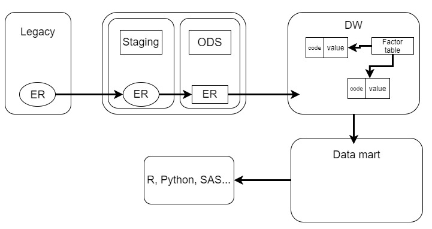

# 3. 데이터 분석

## 1. 데이터 분석 개요

### 1. 데이터 분석 기법의 이해

1. 데이터 처리

    - 

    - Legacy : 이전부터 사용하던 기술 (대체 가능)
    - ER : 데이터 모델 중 하나
    - Staging : 데이터 원천에서 받아들인 데이터를 어떤 데이터인지 확인함. (아무작업도 안함)
    - ODS(Operational Data Store) : 데이터 품질 테스트에서 하고, 데이터 클렌징 작업 실행
    - DW(Data Warehouse) : 쓰면 수정이 불가능하며 읽기만 가능 (시계열성으로 계속 테이블형태로 저장)
    - Data Mart : 한 부서의 데이터 웨어하우스를 뜻하며 특정부서 목표에 필요한 데이터를 DW에서 추출하고 쌓아둠

2. 시각화

3. 공간 분석 (GIS)

4. EDA (탐색적 자료 분석)
    > 다양한 차원(Dimension)과 값을 조합해 가며 특이한 점이나 의미있는 사실을 도출하고 분석의 최종 목적을 달성해가는 과정

    - 의미 있을 것으로 판단되는 변수집단과 아닌 집단을 1차 구분
    - 전체 변수가 300개 일 경우, 의미 있는 1차 집단 50개, 2차 집단이 100개, 의미 없는 집단 150개 정도로 구분

5. 통계 분석
    - 기술통계
    - 추측통계

6. 데이터 마이닝

### 2. 기초분석 및 데이터 관리
1. 데이터 마이닝
    - 대용량 데이터에서 의미있는 패턴을 파악하거나 예측하여 의사결정에 활용

2. 분석목적
    - 예측
      - 분류규칙(회귀분석, 판별분석, 신경망, 의사결정나무)
    
    - 설명
      - 연관규칙(동시발생매트릭스)
      - 연속규칙(동시발생매트릭스)
      - 데이터 군집화(K-Means Clustering)

3. 기초분석 및 데이터 관리
    1. **데이터 EDA(탐색적 자료분석)**

    2. **결측값**
      - 결측값 인식
        - NA, 9999999, ' ', Unknown 등
        - 결측값 자체가 의미 있는 경우가 있음
          > 인구통계데이터(아주 부자, 아주 가난한 경우 정보 미기입 등) 

      - 결측값 처리방법
        - 단순대치법
          - Completes ananlysis
            > 결측값 삭제 
          - 평균 대치법(Mean Imputation)
            - 비조건부 평균대치법 : 관측데이터의 평균으로 대치
            - 조건부 평균대치법 : 회귀분석을 활용한 대치법

          - 단순확률 대치법(Single Stochastic Imputation)
            > 평균대치법에서 추정량 표준 오차의 과소 추정문제 보완(Hot-deck 방법, nearest neighbor 방법)

        - 다중 대치법(Multiple Imputation)
          - 단순대치법을 한번하지 않고 m번 대치를 통해 m개의 가상적 완전 자료를 만드는 방법
      
      > 결측값의 경우 Bad Data는 삭제 필요
    
    3. **이상치(Outlier)**
      - Outlier 인식
        - ESD(Extreme Studentized Deviation)
        - 기하평균 - 2.5 * 표준편차 < Data < 기하평균 + 2.5 * 표준편차
        - 사분위수 이용하여 제거(Box flot이용)
          > 이상값 정의 Q1 - 1.5(Q3-Q1)< Data < Q3 + 1.5(Q3-Q1)를 벗어난 데이터

      - 극단값 절단
        - 기하평균을 이용한 제거
          > geo_mean(기하평균)

        - 하단, 상단 % 이용한 제거
          > 10% (상하위 5% 절단)
      
      - 극단값 조정 방법
        - 상한값과 하한값을 벗어나는 값들을 하한, 상한값으로 바꾸어 활용하는 방법

---

## 3. 통계분석

### 1. 통계분석의 이해
> 특정집단을 대상으로 수행한 조사나 실험을 통해 나온 결과에 대한 요약된 형태의 표현

1. 통계 획득방법
    
    - 총 조사 / 전수 조사 : 대상 집단 모두를 조사하므로 특별한 경우를 제외하고는 사용하지않음

    - 표본조사
      - 모집단(population) : 조사하고자 하는 **대상 집단 전체**
      - 원소(element) : 모집단을 구성하는 개체
      - 표본(sample) : 조사하기 위해 추출한 모집단의 일부 원소
      - 모수(parameter) : 표본 관측에 의해 구하고자 하는 모집단에 대한 정보
      - 통계량(statistic) : 표본 관측에 의해 구한 정보

    - **표본 추출 방법**
      - 단순랜덤 추출법(simple random sampling)
        - 임의의 n개를 추출
      
      - 계통추출법(systematic sampling)
        - 임의 위치에서 매 k번째 항목을 추출
      
      - 집락추출법(cluster random sampling)
        > 지역표본추출, 다단계표본추출
        - 군집을 구분 -> 단순랜덤추출 -> 샘플링 or 모든자료 활용
      
      - 층화추출법(stratified random sampling)
        - 유사한 원소끼리 몇개의 층으로 나누어 각 층에서 랜덤추출

    - 측정방법
      - 명목척도(질적 척도)
        > 어느집단에 속하는지 분류(성별, 출생지)
      - 순서척도(질적 척도)
        > 서열관계를 관측(학년, 신용등급, 만족도)
      - 구간척도(양적 척도)
        > 속성의 양을 측정(온도, 지수)
      - 비율척도(양적 척도)
        > 절대적인 기준이 존재하고 사칙연산이 가능한 척도(무게, 나이, 시간, 거리)    

2. 추정과 가설 검정

    - 가설 검정 : 모집단에 대한 어떤 가설을 설정한 뒤에 표본관찰을 통해 그 가설의 채택 여부를 결정하는 분석방법(귀무가설 vs 대립가설)
      - 귀무가설 : '비교하는 값과 차이가 없다. 동일하다'를 기본으로 하는 가설
      - 대립가설 : 뚜렷한 증거가 있을 때 주장하는 가설

### 1. 회귀분석
> 하나나 그 이상의 독립변수들이 종속변수에 미치는 영향을 추정할 수 있는 통계 기법

- 회귀 분석의 변수
    - 독립변수 : 영향을 주는 변수
    - 종속변수 : 영향을 받는 변수

- Logistic Regression
    > 성능이 좋은 편은 아니지만 설명력이 필요한 경우에 좋음

### 2. 시계열 자료
> 시간의 흐름에 따라 관찰된 값들을 시계열 자료라 함

- 이동평균법
    - 과거부터 현재까지의 시계열 자료를 대상으로 일정기간별 이동평균을 계산하고, 이들의 과거 추세를 파악하여 다음 기간을 예측하는 방법

- 지수평활법
    - 과거의 모든 자료를 사용하여 평균을 구하면서 최근의 자료에 **더 높은 가중치**를 부여하는 방법