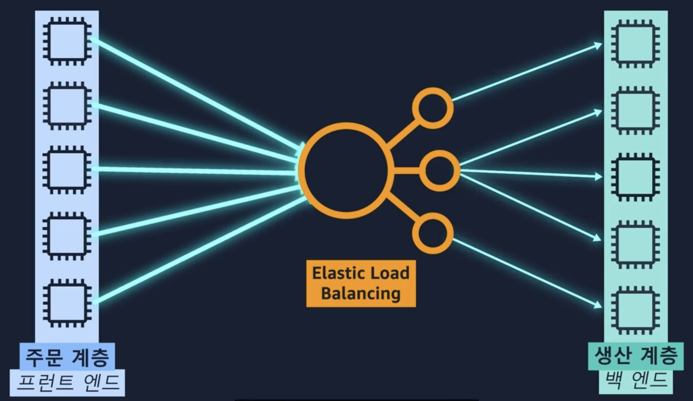

# Cloud Computing

## Client-Server Model

1. Cloud Computing 배포 모델
    - Cloud 기반 배포
      - Application의 모든 부분을 Cloud에서 실행
      - 기존 Applicationd을 Cloud로 migration
      - Cloud에서 새 애플리케이션을 설계 및 빌드

    - On-Premise(Private Cloud) 배포
      - 가상화 및 리소스 관리 도구를 사용하여 리소스를 배포
      - Application 관리 및 가상화 기술을 사용하여 리소스 활용을 높임
 
    - 하이브리드 배포
      - Cloud 기반 리소스를 On-Premise 인프라에 연결
      - Cloud 기반 리소스를 Legacy IT Appication과 통합

2. Amazon Elastic Compute Cloud(EC2)
    - 멀티 테넌시
    - 인스턴스 수직 확장
    - 네트워킹 측면 제어 가능
        > CaaS 서비스로서의 컴퓨터

    1. 인스턴스 종류
      - 범용 인스턴스
        > 컴퓨팅, 메모리, 네트워킹 리소스를 균형있게 제공
      - 컴퓨팅 최적화 인스턴스
        > 고성능 프로세서 애플리케이션에 적합 
      - 메모리 최적화 인스턴스
        > 고성능 데이터베이스
      - 엑셀러레이티드 컴퓨팅 인스턴스
        > 데이터 처리를 가속화할 수 있음(게임)
      - 스토리지 최적화 인스턴스
        > 대규모 데이터 세트 순차적 읽기     

    2. EC2 요금
        - 종량제 과금제도
            > 필요한 만큼만 지불(온디맨드 제공)
        - 온디맨드(비쌈)
          - 시간당, 초당 지불

        - Savings Plans
          - 일정(평균) 사용량 기준으로 지불

        - 예약 인스턴스
          - 약정 기간 설정하여 저렴하게
            > 1년 or 3년간 일정한 사용량에 적합

        - 스팟 인스턴스
          - 백그라운드 처리작업 부분 사용
            > 시작시간 및 종료시간이 자유롭거나 중단을 견딜 수 있는 워크로드에 적합
        - 전용 호스트
          - 물리적 서버를 통째로 빌림(제일 비쌈)

    3. EC2 Auto Scaling (확장성, 탄력성)
        - 필요한 리소스만으로 시작하고 상황에 따라 확장 및 축소
        - 수평(갯수) 확장, 수직(사양) 확장
        - Amazon EC2 Auto Scaling : 인스턴스 자동 추가 제거
          - 동적 조정 : 수요 변화에 대응
          - 예측 조정 : 예측된 수요에 따라 자동 예약  
  
    4. Elastic Load Balncing(ELB)
        > 단일 Amazon EC2 인스턴스가 전체 워크로드를 처리하지 않아도 되도록 보장
    
        - 리전 수준 구조
          - front-end -> ELB -> Back-end로 전달
          - 가장 적은 백엔드로 요청 
          - 

3. 메시징 및 대기열
    > 밀결합된 아키텍처 -> 소결합된 아키텍처(메시지 대기열)
  
    1. SNS(Simple Notification Service)
        - PUb/Sub(게시/구독) 서비스
        - 구독자가 Web Server, E-mail address, AWS Lambda function

    2. SQS(Simple Queue Service)
        - 메시지 손실이나 다른 서비스 사용 없이 소프트웨어 구성요소간에 메시지를 전송, 저장, 수신 가능
        - 가장 적합한 대기열로 넣어줌  

        [SNS vs SQS](https://seohyun0120.tistory.com/entry/AWS-SNS-vs-SQS-%EC%B0%A8%EC%9D%B4%EC%A0%90)

4. Serverless
    1. AWS Lambda
       - 15분 미만 실행 권장(Web Server)

     2. Amazon Elastic Container Service(Amazon ECS)  
        - Container(code Package)
          > 가상머신과 유사함 격리되어 실행
        - Container Orchestration

    3. Amzaon Elastic Kubernetes Service(Amazon EKS)

        > Fargate : Serverless Computing Flatform (ECS or EKS)

---

## Processing

1. Server vs Serverless
  - Server(EC2) : 완전한 OS
    > Serverless(AWS Lambda)
  
    - Server
    - Serverless
      - ECS or EKS
      - EC2 or Fargate 

## AWS 제어 방법
 
- AWS GUI
  - Management console
 
- CLI
  - aws 
 
- SDK
 
- API