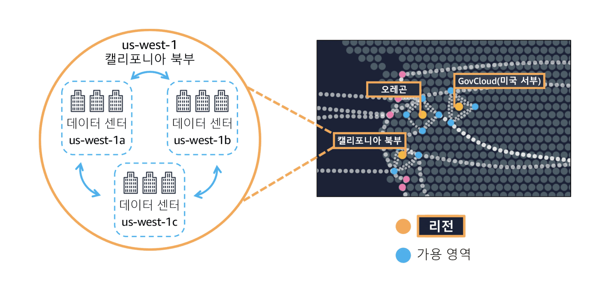

# Global_infra

## AWS 데이터 센터

1. Data Region(지리적으로 격리)
    - 규정준수(나라별 법규)
    - 지연시간(실제 이용자와의 거리)
    - 기능 가용성(새로운 기능이 나올때 다를 수 있음)
    - 요금(센터별로 다름)

    

2. Edge Location(Amazon Cloud Front)
    - 브라질 -> 한국
    - EC2 instance(브라질) -> 캐시 전송 -> Edge Location(한국) -> 고객
---

고가용성 및 내결함성
Amazon Braket

CDN
Amazon Cloud front
Route 53
AWS outposts