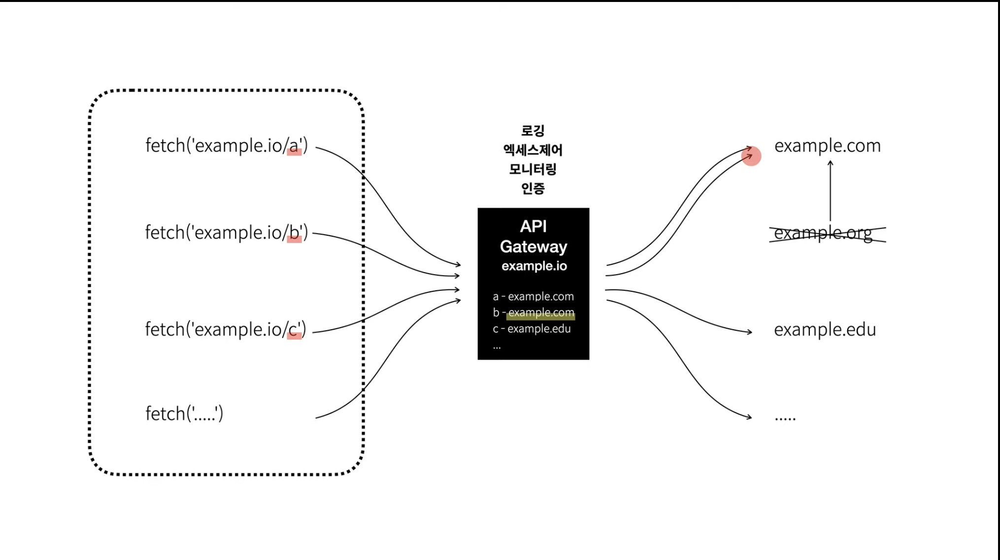
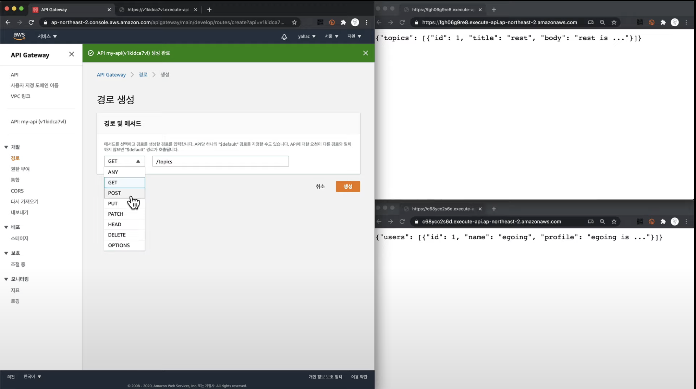

# AWS API Gateway
> 자신만에 고유한 주소가 있음

- 람다와 연결(서버리스 플랫폼)

## 구조 
- 웹을 관리할때, 중간에 Gateway를 통해 쉽게 관리함

## 종류

- HTTP API 
  - 스테이지 / URL 호출 / 주소
  - API Gateway > 경로 or 통합 > 생성 

- REST API
- Web Socket API

--- 
보기전에 REST API 봐야함