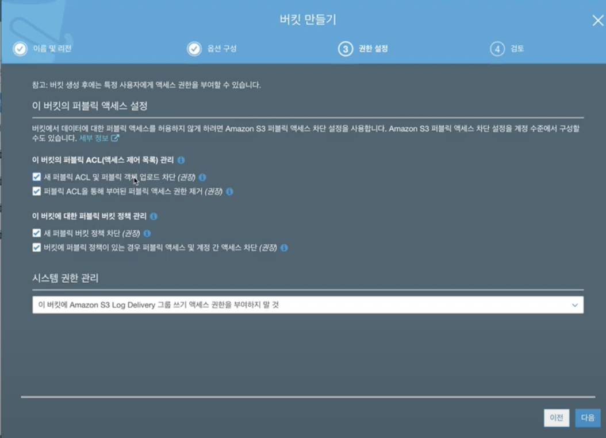

# AWS Simple Storage Service

## 사전지식

- 내구성 : 최소 3개 이상의 가용영역에 저장하여 100억 분에 1로 계약됨

## 구성요소

- Bucket
  - Folder
    - Object(file)

- Bucket 
  - 이름은 변경 불가능
  - 다른 내용은 수정 가능

- Folder
  - 이름을 수정하려면 새폴더를 만들고 자료를 옮기고 기존 폴더 삭제로 진행

- Object

---

객체 파일부터