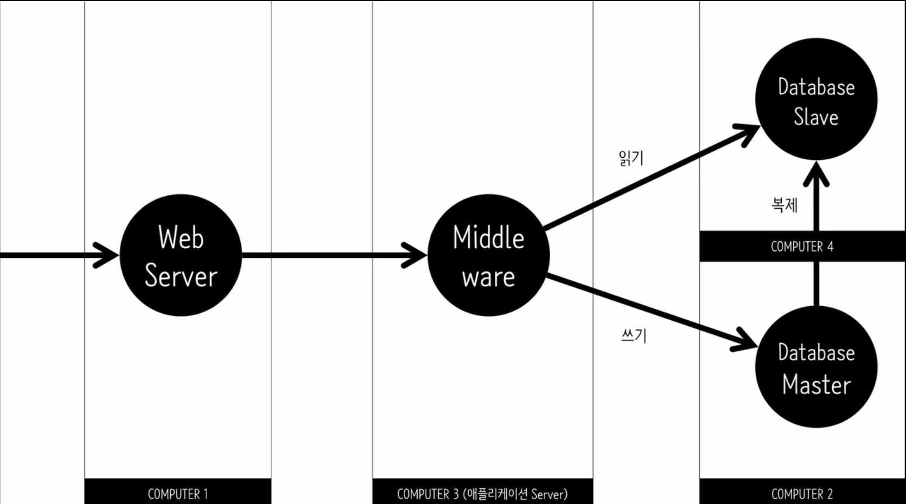
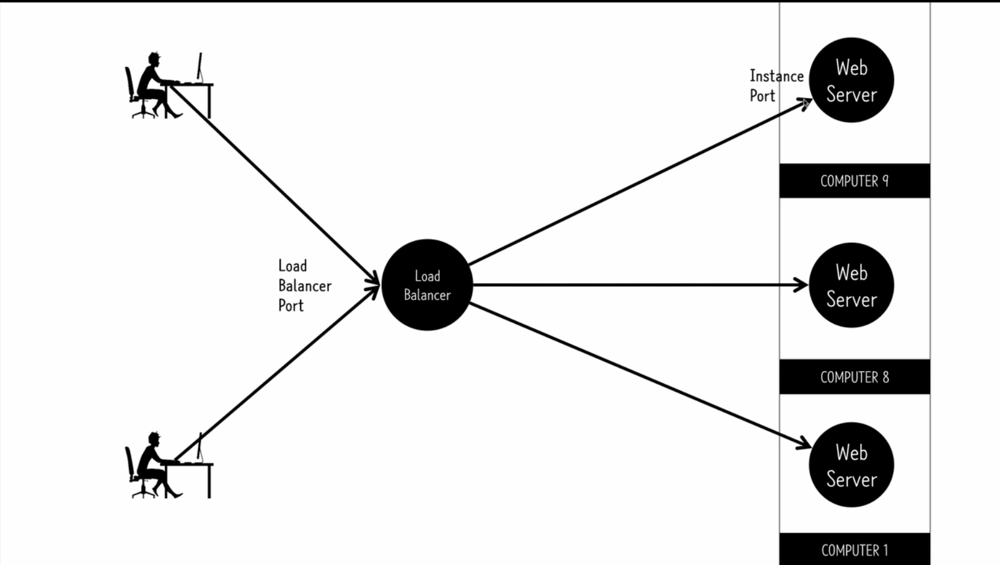
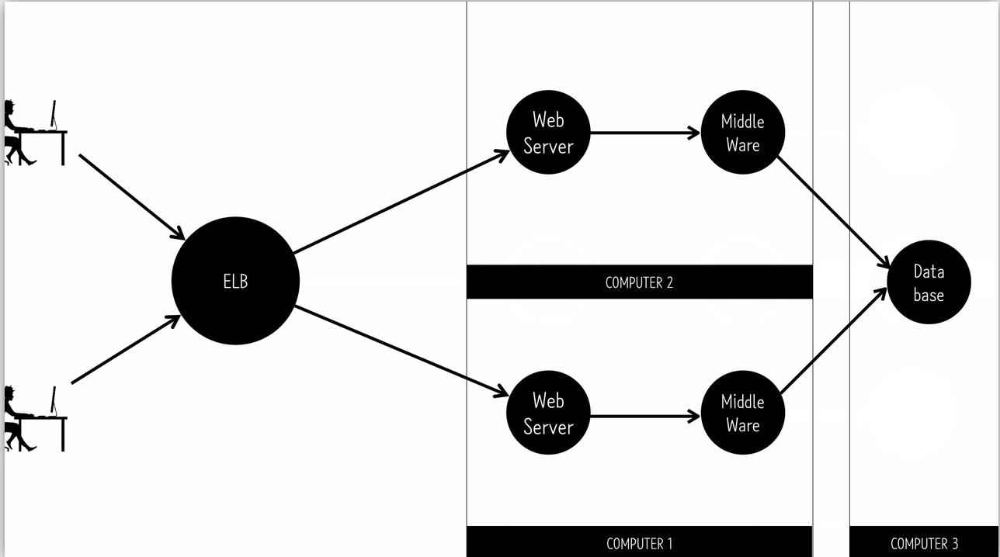

# Scalabilty
  > 변화하는 수요에 얼마나 탄력적으로 대응하는가
 
## Scale Up
  > 한대의 컴퓨터의 성능을 높임
 
### 가상머신
  - computer / 운영체제 / 가상머신 / 운영체제
  - 
  - VMWare, VirtualBox, Parallels
 
### Scale Up
  - 스트레스 테스트
    - 리눅스 원격접속 : ssh -i ~/dev/Documents/dev/key/키pem 아이피주소
    - ab (부하발생기)
      - -n : 총 접속수
      - -c : 동시 접속수
  - 인스턴스 교체
    - 현재 인스턴스 AMIs 이미지 생성 -> AMIs에서 이미지 선택 후 launch -> Elastic IPs에서 연결 해제 후 다시 선택
 
### Elastic IPs
  > 고정 IP
  - 인스턴스 연결
    - associate address -> 인스턴스 선택
---
## Scale Out
  > 컴퓨터를 여러대로 늘림
 
### Scale out의 흐름
  - Web Server(aphach, nginx) -> Middle ware(jsp, django) -> Database(oracle, mysql)
  - 
  - Load Balancer : 부하의 균형을 잡아주는 서비스
    - Load Balancer의 IP에 접속하면 사용자의 접속을 분산시켜줌
 
### ELB(Elastic Load Balancer)
  > AWS를 통해 managed
  - Load Balancer Port로 접속 -> Load Balancer -> Instance Port
  - 
  - Configure Health Check
    > 로드 밸런서가 인스턴스에 접속해서 체크를 하는 조건 설정
  - 주의사항 
    - 데이터베이스는 저장되는 곳이 한군데이어야함
    - 
---
## Auto Scaling
  > Load Balancing을 자동으로 해줌

1. launch configuration
    - 이미지 설정
    - 발동 조건(event)
2. auto scaling
    - cloud watch를 통해 CPU 감시