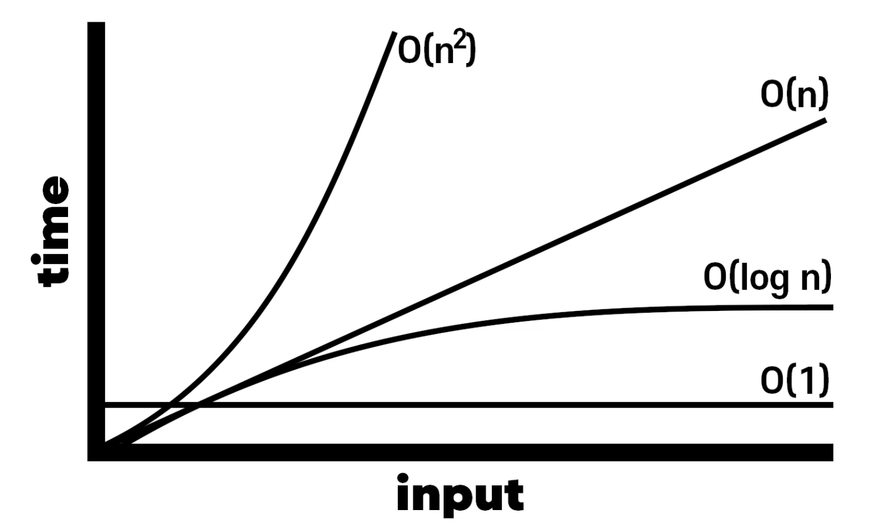

# algorithm

1. 문제의 크기 분석
2. 시간복잡도 고려
3. 메모리 제한

## 공부방식
- 어떤 문제를 해결하는 방법
- 대부분 개발의 크기보다 작음
- 원리와 증명도 중요하지만 응용이 더 중요함
- **문제 풀이**

## 효율성
1. 수행시간 (가장 중요)
2. 메모리
3. 코드의 길이

## 문제의 크기
- 동시접속자 10명 vs 동시접속자 10만명
- 대부분 가장 빠른 방법이 정해져있지만, 너무 어려운 경우 상대적으로 느린 방법을 이용하기도 함 (문제의 크기를 먼저 보고 방법을 생각해야함)

## 검색 알고리즘
- Linear Search(선형 검색)
  > 0부터 끝까지 순차 검색
    - linked-list에서 자주 활용

- Binary Search(이진 검색)
  > 데이터를 반으로 나누어서 연산
    - Tree에서 많이 사용

## 시간 복잡도
- Big O Notation
  - 실제 러닝 타임이 아니라 데이터나 사용자의 증가율에 따른 알고리즘 성능 예측
    > data * time
- linear search : O(n)
- bynary search : O(log n)

- 입력크기 N에 대해서 얼마나 걸릴지 나타내는 방법

## 메모리
- 메모리 제한은 보통 넉넉함
- 대략적인 예상 가능
  > ex) 배열 : 배열의 크기 * 자료형의 크기 
- 배열의 크기가 크면 시관초과 받는 경우가 많음

## 정렬

- 버블 정렬 : O(n^2) 
  - 순차적으로 앞뒤를 비교하며 숫자를 옮김

- 선택 정렬 : O(n^2)
  - 가장 작은 수를 찾아 맨 앞에 배치