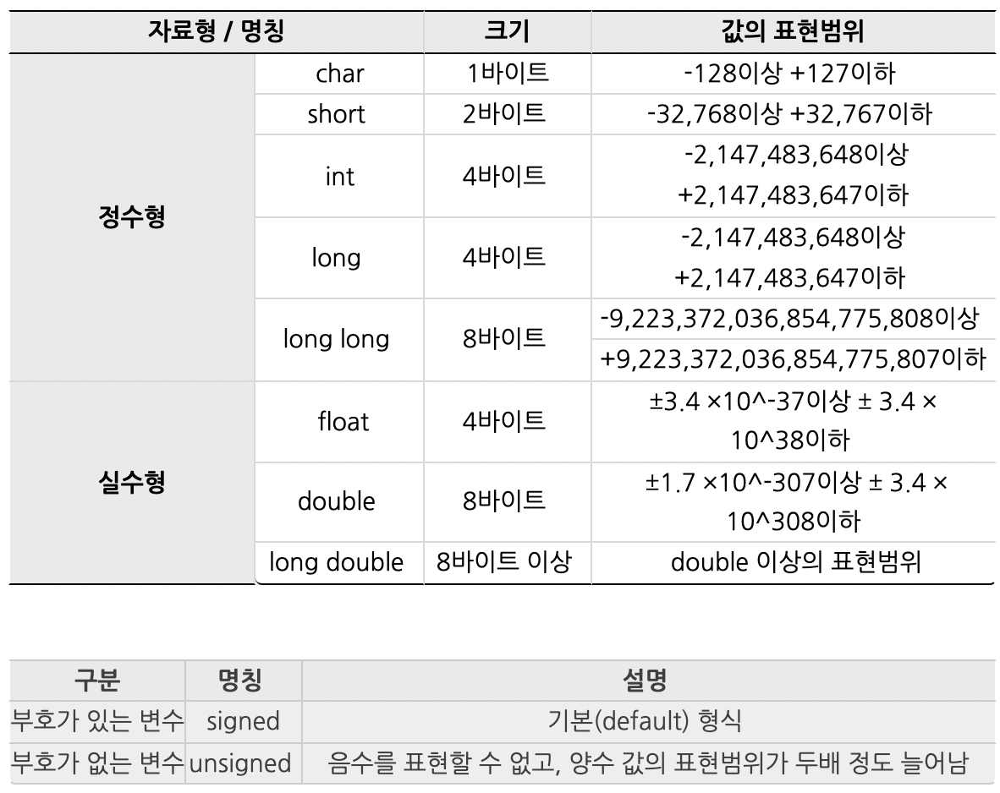
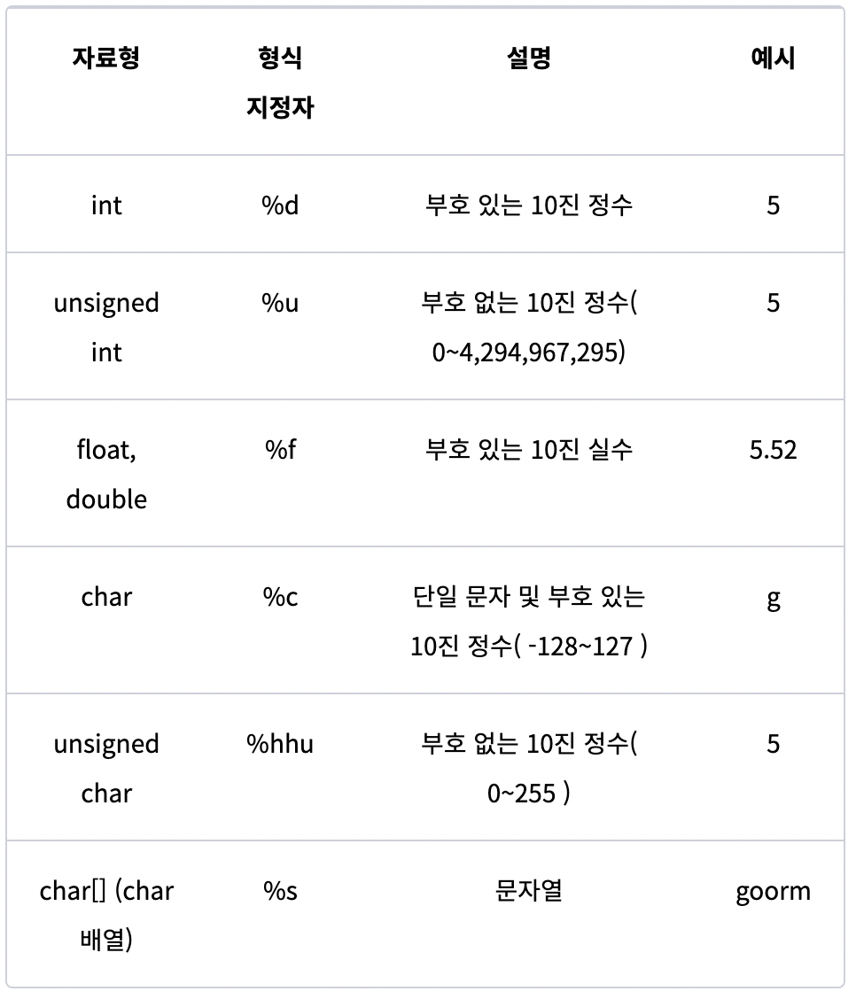

# C언어

## 변수란?

- 숫자, 문자 같은 값들을 저장하는 공간
- 파이썬과 달리 자료형을 선언해야함
- 값을 대입

``` C
#include <stdio.h>

int main(){
    int level;
    int hp;
    int damage;
    int defense;

    level = 1;
    hp = 50;
    damage = 5
    defense = 2;

    return 0;
}
```

- 선언과 동시에 값을 대입 : 초기화

``` C
#include <stdio.h>

int main(){
    int level = 1;
    int hp = 50;
    int damage = 5;
    int defense = 2;
    
    return 0;
}
```

## 자료형



## 변수 출력
> 변수를 출력할땐 파이썬에서 f스트링과 유사한 방식으로 출력해줘야함



- %.3f 등 소수점 자리 표시는 반올림하여 표시하게됨
    > 컴퓨터는 2진수로 구성되어 소수점인 10진수를 정확히 표현할 수 없음