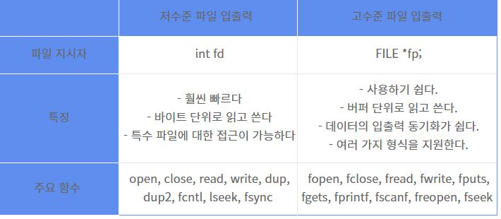

# C

- header : unistd.h

## 저수준 파일 입출력
- 파일을 읽고 쓰는 방법은 저수준, 고수준으로 구분됨



### File Descripter
- 리눅스에서 파일을 읽고 쓰기 위해서는 반드시 파일을 open 해야함. 파일이 오픈되면 file descriptor라는 index 번호가 반환되고, 이 값은 파일을 오픈한 프로세스의 고유 번호라고 생각하면 됨

- file descriptor는 C int 타입으로 표현되고, 최대값은 1,024지만 1,048,576번까지 설정 가능하며 관례적으로 0,1,2번은 사전에 배정되어있음

- 0 : 표준 입력 (stdin)
- 1 : 표준 출력 (stdout)
- 2 : 표준 오류 (stderr)

- 파일 생성시 3번부터 file descriptor가 부여됨

## C언어 자료형
- signed : 정수형 처리에서 부호가 있는 자료형
- unsigned : 정수형 처리에서 부호가 없는 자료형

## 기본용어
- buffer : 일시 저장소
- &#42; : asterisk(포인터를 가리킬때 사용)
- & : ampersand(주소를 가리킬때 사용)
- % : percent(포맷 출력할때 사용)
  - %d : 정수형
  - %0.3f : 실수 소수점 0.3 까지 출력(숫자 바꿔도 됨)
  - %x : 정수를 16진수로
  - %c : 문자 한개
  - %s : 문자열

## write()
```c
#include <unistd.h>

int main(){
    write(fd, str, size)
}
```
## read()
  > 파일,

---

## mac command line tools 설치

- sudo xcode-select --install
  - 설치

- sudo rm -rf /Library/Developer/CommandLineTools
  - 삭제