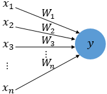
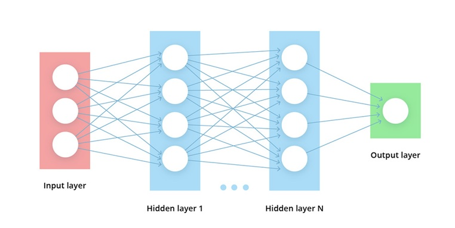

# Deep Learning

## Perceptron

- x는 입력값, W는 가중치(Weight), y는 출력값
- 입력값에 각각 가중치가 존재하고, 가중치 값이 크면 클수록 입력값이 중요한 것

## Deep Neural Net

- Neural Net이 깊다. (Layer 2개 이상)
- Partial derivatives(using chain rule)