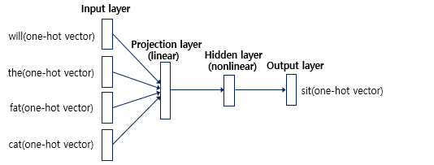
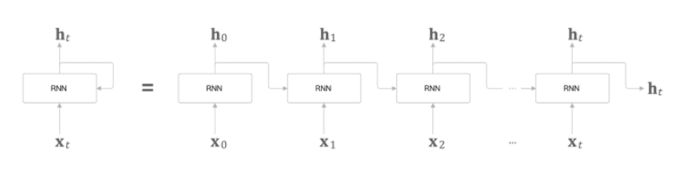
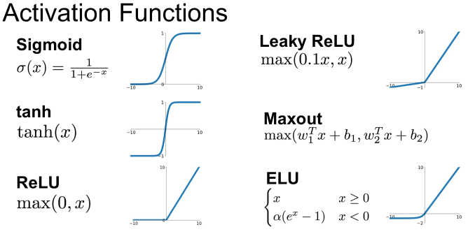

# Recurent Neural Network(순환신경망)
- 시계열(순차)데이터를 모델링 하는 일종의 주류 딥러닝 모델
- Feed-Forward Nurel Network(피드 포워드 신경망)의 개선 목적으로 나옴

## Feed-Forward Neural Network(=Neural Network Language Model)

- Window : NNLM은 다음 단어를 예측할 때, 앞의 모든 단어를 참고하지 않고 정해진 n개의 단어만 참고하여 예측하는데 이 n값이 Window

> 예문 : "what will the fat cat sit on"

- categorical data이므로 one-hot vector 진행하여 진행하여야함

``` python
what = [1, 0, 0, 0, 0, 0, 0]
will = [0, 1, 0, 0, 0, 0, 0]
the = [0, 0, 1, 0, 0, 0, 0]
fat = [0, 0, 0, 1, 0, 0, 0]
cat = [0, 0, 0, 0, 1, 0, 0]
sit = [0, 0, 0, 0, 0, 1, 0]
on = [0, 0, 0, 0, 0, 0, 1]
```

---

- 위에서 one-hot vector를 입력받아 Projection layer(투사층) -> Hiden layer -> Ouput layer로 나옴



> [Feed-Forward Nural Network](https://wikidocs.net/45609)


- 한계점 : sequential data(시간, 문장 등)은 길이가 모두 달라 다양한 길이의 입력 시퀀스를 처리할 수 있는 인공 신경망이 필요
    > squential data 데이터에 약함
---

## RNN

- Feed-Forward Nural Network의 순서에 담긴 정보까지는 알 수 없었던 것을 알 수 있게 해줌




- activate function
    - 기본적으로 tanh를 활용
    - ReLU는 너무 발산하고 sigmoid는 너무 좁아 기울기 소실문제 발생



- 한계점
  - Gradient Vanishing : 역전파 도중 과거로 올라갈 수록 gradient 값이 0에 수렴해서 현재 셀에 멀리있는 정보는 영향이 거의 없어지는 현상
    > 연속해서 곱해지는 미분 값들(jacobian matrix)이 1보다 작으면 발생 


  - Gradient Explosion : gradient 값이 무한대에 가까운 값이 더해져서 최적의 parameter를 못찾는 현상
    > 미분값들(jacobian matrix)이 1보다 크면 발생 

- 참조
  - Back Propagation Through Time Algorithm : 역전파

  - jacobian matrix : 은닉층 차원 함수의 지역적인 변화 특성을 파악할때, 함수의 극대 or 극소값을 찾을 때 사용 


---

## Long Short-Term Memory(LSTM)

- RNN은 너무 많은 정보를 가져가서 문제가 발생하여 RNN기반의 cell이 등장

- [mechanism](https://youtu.be/bX6GLbpw-A4)

[LSTM 활성화 함수 Tanh vs ReLU](https://stats.stackexchange.com/questions/444923/activation-function-between-lstm-layers)