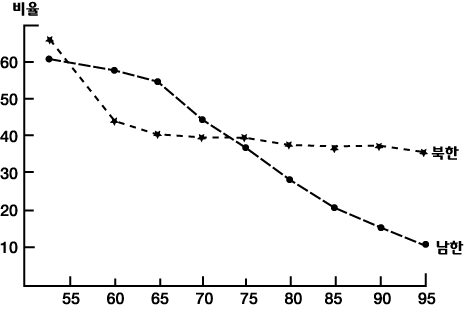

# Time_Series Data⏳

## 시계열 데이터의 종류
1. 비정상성 시계열 자료(대부분 여기 포함🤣)
    - POS(Point of sales) 구매 자료 (불규칙적인 시차)
    - 일일 코스피 주식가격

2. 정상성 시계열 자료
    > 월별/분기별/연도별 특정 사건의 수치 (규칙변동)
    - **추세변동**  
    
    - **계절변동**  
     
    - **순환변동**  
     

> Y축을 확인 하여 **⭐Noise값에 영향을 얼마나 받는가** 확인이 필요

---

## 시계열 데이터 분석 방법
- 회귀분석
- Box-Jenkins 방법
- ⭐**지수평활법**⭐(exponential weighted function)
- 시계열 분해법

---
### 지수평활법
- 센서에서 발생하는 noise를 smoothing 
- exponential weighted function(지수 평활법)
- x값이 음수인 지수함수만큼 가중치가 줄어듬(과거의 경향성 // 지수적 감쇠)
- $\frac{1}{1-\beta }$식으로 나온다
  > β​​값이 0.98이면 50이 나와 50 이후는 영향력이 없어짐

https://m.blog.naver.com/nilsine11202/221903150950

#### 지수 평활법 특징

1. 단기간에 발생하는 불규칙변동을 평활하는 방법

2. 자료의 수가 많고 안정된 패턴을 보이는 경우일수록 예측 품질이 높음

3. 지수평활법에서 가중치의 역할을 하는 것은 지수평활계수(α)이며, 불규칙변동이 큰 시계열의 경우 지수평활계수는 작은 값을, 불규칙변   동이 작은 시계열의 경우, 큰 값의 지수평활계수를 적용함(generally, α is between 0.05 and 0.3)

4. 지수평활계수는 예측오차(실제 관측치와 예측치 사이의 잔차제곱합)를 비교하여 예측오차가 가장 작은 값을 선택하는 것이 바람직 함

5. 지수평활계수는 과거로 갈수록 지수적으로 감소함

6. 지수평활법은 불규칙변동의 영향을 제거하는 효과가 있으며, 중기 예측 이상에 주로 사용됨(단, 단순지수 평활법의 경우, 장기추세나 계   절변동이 포함된 시계열의 예측에는 적합하지 않음)