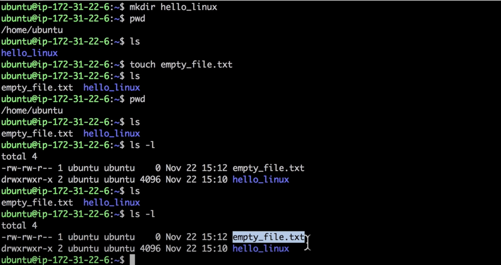
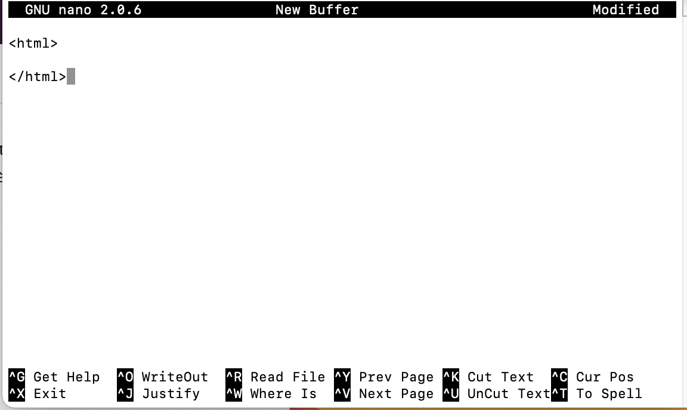

# Linux
> Cloud9, OSX를 통해서도 가능

- Command Line Interface(CLI) 환경

- OSX
  > Mac은 Linux는 아니지만 Unix라는 공통의 조상을 가지고 있어 조작방법이 거의 유사함

- 리눅스는 성공시 아무말도 하지않음

## 명령어
  > 구조 : 명령어 -parameter(option)

### Directory

- 도움말 : (명령어) --help 또는 man (명령어)
  > man 입력시
  - 검색 : /내용
  - 나가기 : Q
- 기본 명령어
  - ls : 현재 directory에 있는 파일 반환
    - -al : 모든 항목을 보여줌
    - -l : 자세히 보여줌

  - pwd : 현재 directory의 경로를 반환

  - mkdir : 현재 directory에 폴더 생성
    - -p : parent directory 생성 dir1/dir2/dir3

  - rm : 파일 삭제
    - -r : directory 삭제

  - touch : touch 뒤에 파일명을 입력하면 파일 생성

- 이동 및 카피
  - cp : cp 보낼파일 복사받을 위치
    > cp cp.txt dir/cp.txt
  - mv : mv 보낼파일 mv.txt dir/mv.txt

- ls표시를 하였을때
  - dr~~ : 폴더
  - -rw~~ : 파일

### Permission
> sudo(super user do)

- rm -rf / : 묻지도 따지지도 않고 directory 안에 내용 모두 삭제
  > 사용하면 절대 안됨

- apt-get install git : git 설치 명령어
  > sudo로 권한 부여하여야 함

### File edit(nano, vi)
> 파일 편집기

- nano
  > 새로운 파일 생성
  - nano 파일명 : 실행

