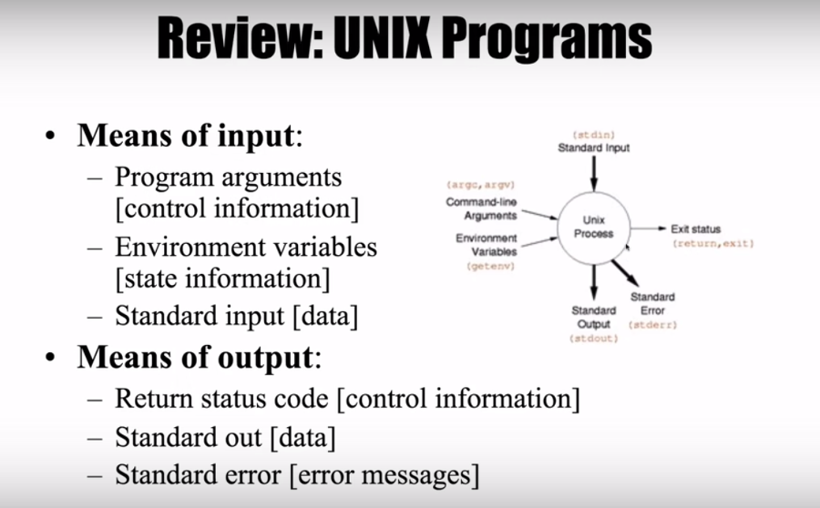

# Linux

## Why using CLI?
> 적은 메모리 사용, 절차 실행(sequence execution)

- 여러 절차를 지정해 놓을 수 있음
  - mkdir why
  - cd why
    > mkdir why;cd why

- Pipeline
  > 하나의 명령의 실행결과를 입력으로 주고 전송함 
  - cat 파일명 : 파일 내용 출력
  - grep 검색어 파일명 : 파일명에서 검색어를 찾아 검색어가 있는 행만 출력
    - ls --help | grep 검색어 (pipe 기능)
    - ps aux | grep 검색어 (pipe)
    > 이전 출력을 입력으로 pipeline 구축

## IO Redirection
> 출력되는 것을 다른곳으로 돌려서 파일에 저장하는 것 
  - < input
  - &#62; output
  - &#62;&#62; append
  - dev/null 휴지통
### Output
- ls -l > result.txt : ls -l의 결과를 result.txt에 저장
  - 1> : standard output (표준 출력)
  - 2> : standard error (표준 에러)

### Input
- 명령어
  - cat < hello.txt : hello.txt를 입력으로 받는다는 뜻
  - head -n1 < linux.txt > one.txt : linux.txt의 내용을 인풋으로 넣고 결과를 one.txt에 저장

## Shell
