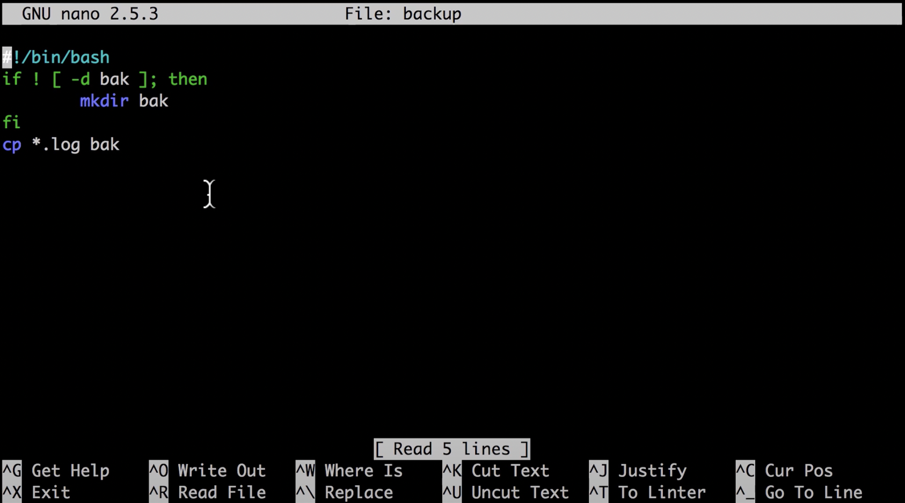

# Linux

## Why using CLI?
> 적은 메모리 사용, 절차 실행(sequence execution)

- 여러 절차를 지정해 놓을 수 있음
  - mkdir why
  - cd why
    > mkdir why;cd why

- Pipeline
  > 하나의 명령의 실행결과를 입력으로 주고 전송함 
  - cat 파일명 : 파일 내용 출력
  - grep 검색어 파일명 : 파일명에서 검색어를 찾아 검색어가 있는 행만 출력
    - ls --help | grep 검색어 (pipe 기능)
    - ps aux | grep 검색어 (pipe)
    > 이전 출력을 입력으로 pipeline 구축

## IO Redirection
> 출력되는 것을 다른곳으로 돌려서 파일에 저장하는 것 
  - < input
  - &#62; output
  - &#62;&#62; append
  - dev/null 휴지통

### Output
- ls -l > result.txt : ls -l의 결과를 result.txt에 저장
  - 1> : standard output (표준 출력)
  - 2> : standard error (표준 에러)

### Input
- 명령어
  - cat < hello.txt : hello.txt를 입력으로 받는다는 뜻
  - head -n1 < linux.txt > one.txt : linux.txt의 내용을 인풋으로 넣고 결과를 one.txt에 저장

## Shell
> shell은 여러개 가지고 있을 수 있음(사용자마다)

### bash vs zsh
- 제품의 차이일뿐
  - zsh가 조금 더 편의성 있음

- 기본 명령어
  - echo $0 : 사용 프로그램 확인
  - cd /h/u/ 이후 tab 키 : 자동완성 기능 적용 (zsh)

### script
- #!/bin/bash : 맨 앞에 #! 붙고 경로가 붙으면 그 프로그램으로 해석해야함 (/bin/bash bash로 해석)

## Directory structure 

- / : root 디렉토리

- /bin : user binaries
  > 실행가능 프로그램(명령어)

- /sbin : system binaries
  > 시스템 관리자

- /etc : configuration files
  > 설정 파일(리눅스는 설정이 파일 형태로 존재)

- /var : variable files
  > 바뀔 수 있는 파일(log)

- /tmp : temporary files
  > 임시파일(재부팅시 삭제됨)

- /home : home directories
  > cd ~ : home directory로 이동

- /opt : optional and add-on applications
  > 앱 디렉토리를 지정할때 여기에 넣으면 좋음

## ps top htop
  > process(ps)

- ps aux : 실행되는 모든 프로그램 표시(작업관리자)
- sudo kill (process id) : 강제 종료

## locate, find

- 파일 종류
  - 데이터 보관
  - 명령어 보관 (실행파일)

- locate(mlocate)
  > directory를 뒤지지 않고 database만 뒤져봄(빠르지만 확실하지않음)
  - sudo mlocatedb : 현재 컴퓨터에 대한 정보를 db에 저장(리눅스는 정기적으로 됨)

- find
  > 디렉토리를 뒤져봄(느림)
  - . : 현재 directory
  - -o : or문
  - -name : 이름으로 검색

  - wild card
    - &#42; : 모든 단어
      > e* : e로 시작하는 모든단어

---

## file 종류

- text
- binary(ascii)
- date

- magic file : 파일분류를 위한 정보가 들어 있음
  > /usr/share/magic이나 /usr/lib/

### 매직파일
- 명령어
  - file
    - -m 매직파일 확인
    - -C -m 컴파일