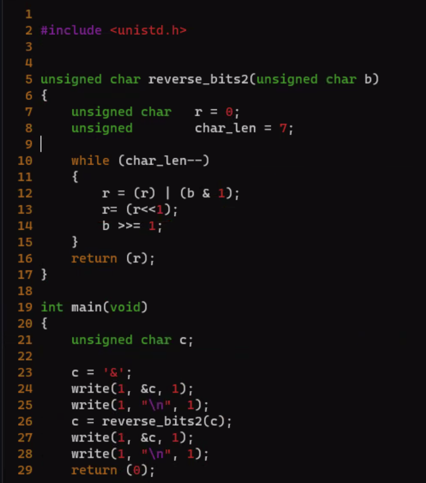

1. ascii 배열 생성
2. argc 지정
3. argv 돌리기
4. ascii [argv[[][]] 값 지정하여 0일때만 출력, 값 1로 변경
5. 개행처리


- stdlib.h

- (int *)malloc(sizeof(int))

---

- -fsanitize=address

- 비트연산은 하나만 & |



search_and_replace.c


```C
#include <stdlib.h>

char	*ft_strdup(char *src)
{
	char	*s;
	int		len;

	while (src[len])
		++len;
	if (!(s = (char *)malloc(sizeof(char) * (len + 1))))
		return (NULL);
	s[len] = '\0';
	while (len >= 0)
	{
		s[len] = src[len];
		len--;
	}
	return (s);
}