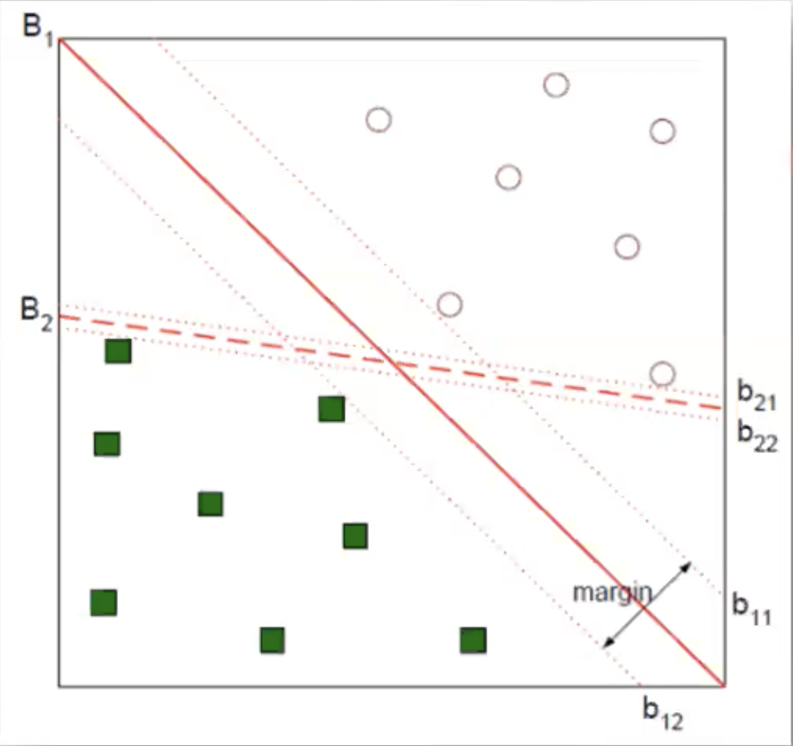
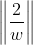
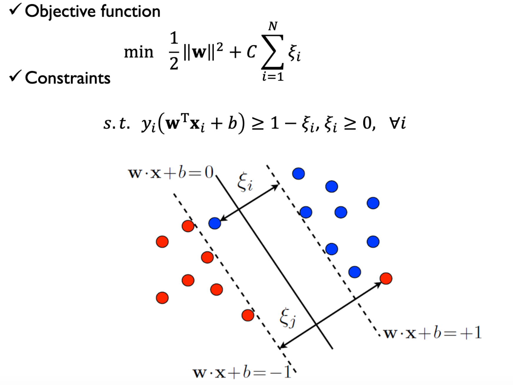
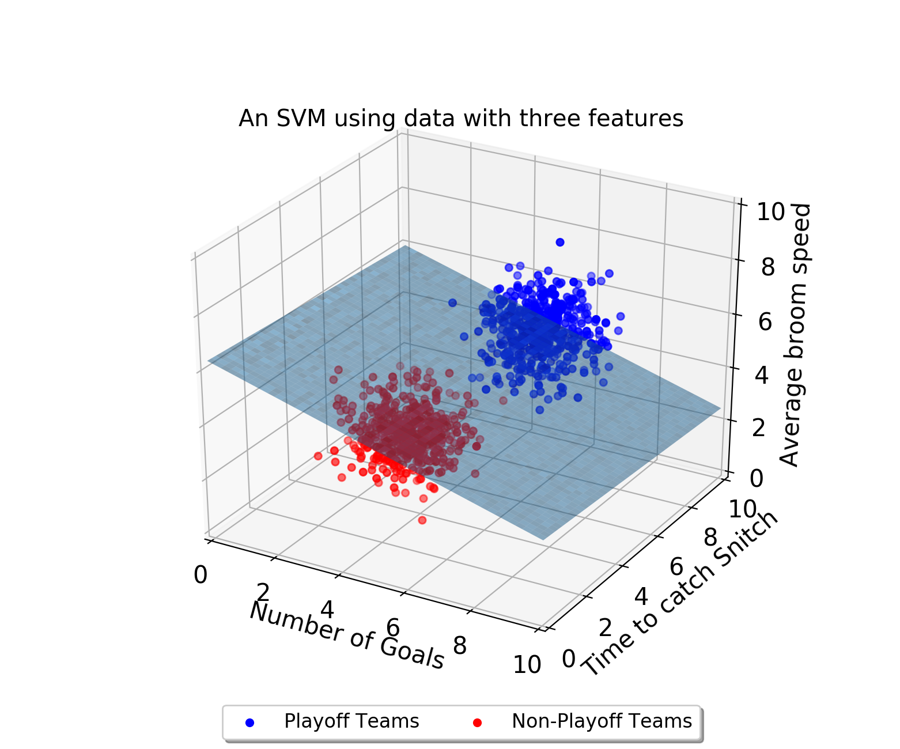

# Support Vector Machine

## 1. regression

## 2. classifier

- B2보다 B1의 **Decision boundary**가 새로운 데이터를 잘 분류해주는 모델
    > Decision boundary = Threshold

- SVM = plus-plane, minus-plane의 magine을 최대화하는 결정경계면을 찾는 기법 
    > 라그랑지안 승수법, KKT(Karush-Kun-Tucker) 조건을 활용한 풀이 http://j.mp/39jz9Y8

### 2-1. Soft-Margin SVM

- Magin = 를 최대화하기 위해 역수를 최소화한 후 미분을 위해 제곱
- C : 얼마만큼 여유를 가지고 error를 허용할건지 판단해주는 값(C가 클수록 오차허용도가 줄어듬)
    > hyper parameter  

### 2-2. Kernel Support Vector Machines
> 선형 분리 불가능시 사용

- original data가 놓여있는 차원을 비선형 매핑하여 고차원 공간으로 변환

