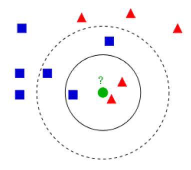
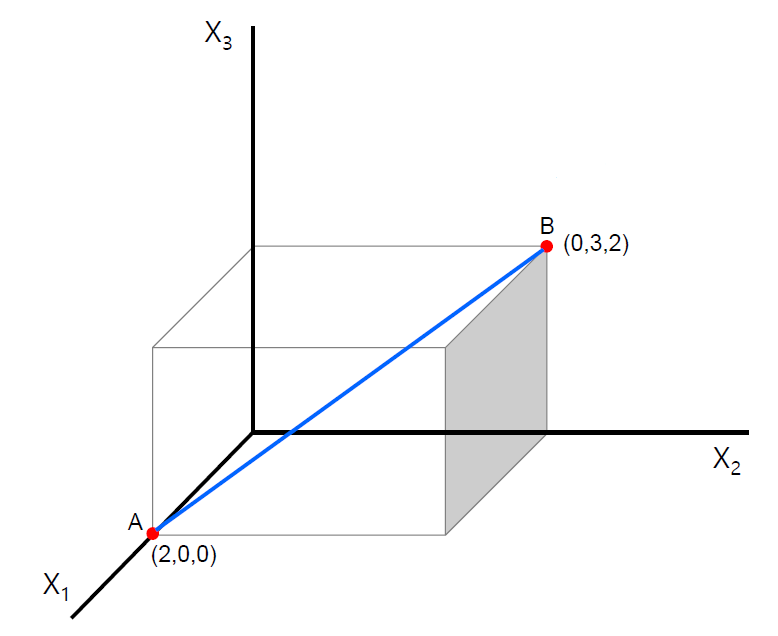
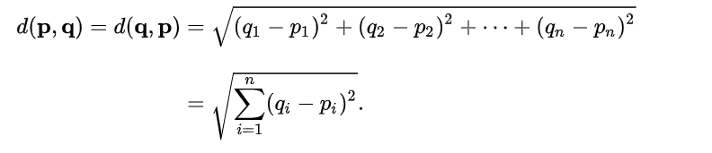
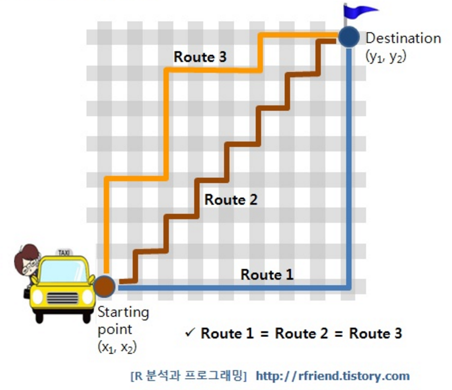
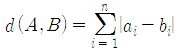
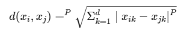
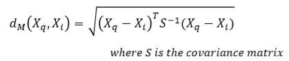
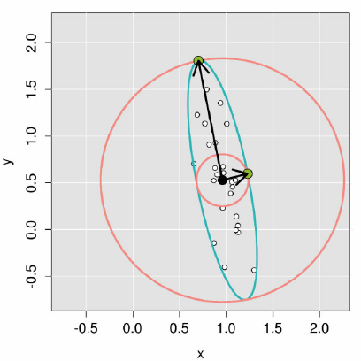

# K-Nearest Neighbor Algorithm
> 성능 안좋음

## KNN
- 속도가 빠르고, 데이터가 입력되면 그제서야 데이터 분류를 함(Lazy model)  

- Hyper parameter
    - K 값
    - 거리 척도

## 거리 척도

### Euclidean Distance
- 제일 기본적인 거리식 **피타고라스**

- 일반적인 거리공식으로 가장 많이 사용됨
- 단위(Km, cm 등)가 다르면 Standardization하여 해결
- 다변량데이터에는 의미있는 거리를 두지 못함(화폐가치, 통행량)

### Manhattan Distance
- 맨하탄도시에서 건물과 건물로 가기위한 최단거리 공식

### Minkowski distance
> L1(Euclidean), L2(Manhattan)

- 맨하탄 거리와 유클리드 거리의 일반화. m제곱한 후 m제곱근을 씌워주는 거리. 두 성분 중 더 크게 떨어진 성분으로 수렴하게 된다. 많이 떨어진 특성을 부각시킬 때 사용한다.

### Mahalanobis distance
- 데이터의 방향성과 상관도를 나타내는 Covariance matrix(공분산 행렬)을 사용함

