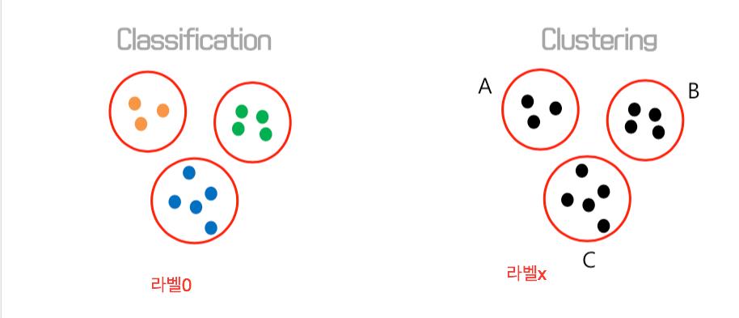

# K-means Algorithm

- Classification은 라벨링된 사전 정보가 존재(Supervised Learning)

- Clustering은 사전정보가 존재 없음

## K-means

- 순서
  1. K개의 임의의 중심값을 고른다
  2. 각 데이터마다 중심값 까지의 거리를 계산하여 가까운 중심값의 클러스터에 할당한다.
  3. 각 클러스터에 속한 데이터들의 평균값으로 각 중심값을 이동시킨다
  4. 데이터에 대한 클러스터 할당(iteration)이 변하지 않을때까지 2와 3을 반복한다

- Hyper parameter
  - K값(군집의 갯수)
  - 클러스터 중심 선정방식
    - randomly choose
      > 일반적 
    - manually assign init centroid
      > ex) 지도상 위치 중심 
    - k-means++
      - c1(첫번째 데이터 포인트) 위치에 하나를 찍는다.
      - c1에서 가장 먼 데이터 값에 c2를 찍는다.
      - c1, c2 모두 가장 먼 값을 찍는다.
 
- k-means는 X값만 넣음(라벨, Y값이 없는 unsupervised Learning)
- k-means.labels_ = Y값으로도 사용 가능 (정답은 아님)
- k-means.cluster_centers_