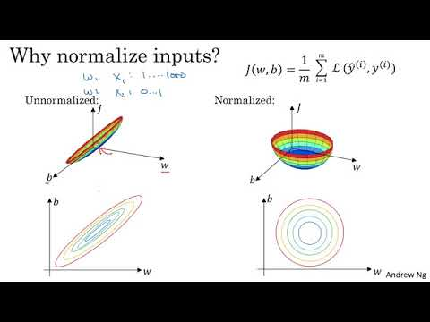

# Feature Scaling
- 이유 : data에서 자릿수의 차이, Scale(범위)이 넓으면 과도하게 가중치가 들어가거나 noise가 많이 발생하여 Scale를 축소 시켜주는 것
  

## 1. Standardization(Z-score)
  > 회귀, SVM(서포트 벡터 머신), NN(신경망)에서는 효과적이다  
- 평균을 0, 분산을 1(표준정규분포표)

## 2. min-max scaling
- 모든 feature를 0~1 사이 값에 위치하게함


## 3. Robust scaler
  > Outlier의 영향이 적다
- 모든 특성들이 같은 크기를 갖는다는 점에서 Standardization과 유사하지만, mean(평균)과 variance(분산) 대신 median(중앙값)과 quartile(분위)을 사용함


## 4. Euclidean Normalizer
  > over fitting 확률이 낮아짐, Normalizer는 유클리드 거리가 1이 되도록 데이터를 조정

  - 다른 정규화는 columns의 통계치를 이용하지만, Normalizer는 row마다 각각 정규화



---


- 새로운 데이터를 넣을때
  ```python
  sc = ~~.MinMaxScalor() # 또는 Standad scaler()
  data = sc.transform([[0.065, 3, 12, 758]])
  model.predict(data)
  ```
  
- 학습시 주의사항
  ``` python
  sc.fit(train_X) # 
  train_X = sc.transform(train_X) # 모델 학습
  test_X = sc.transform(test_X) # 모델 테스트 
  # 학습, 테스트시 X_data를 넣지않고 train, test data를 넣어야함
  ```
