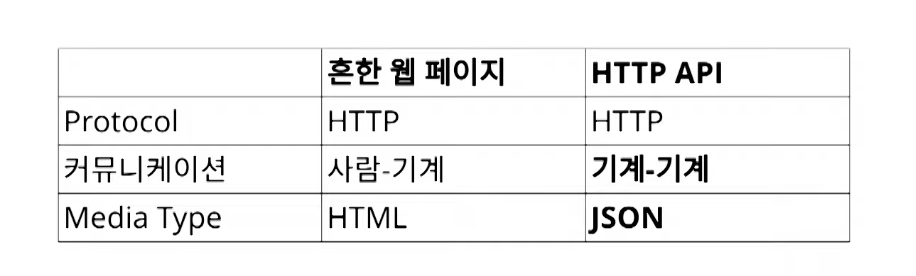
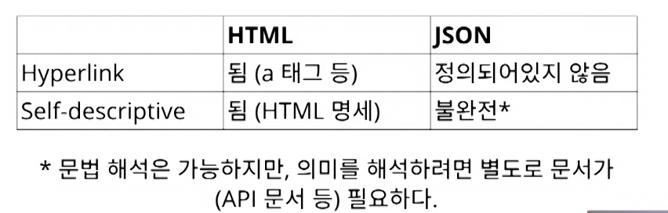
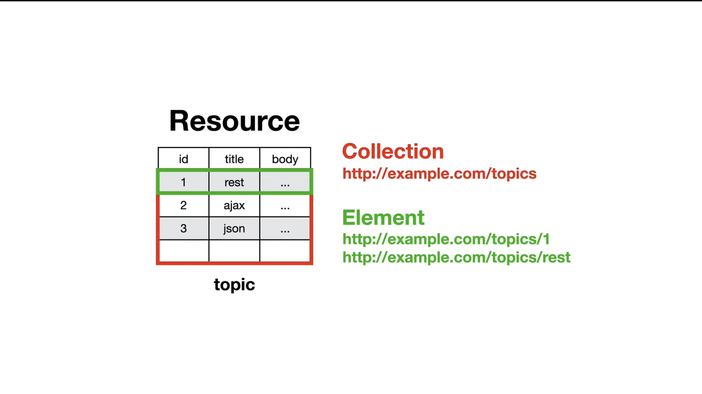
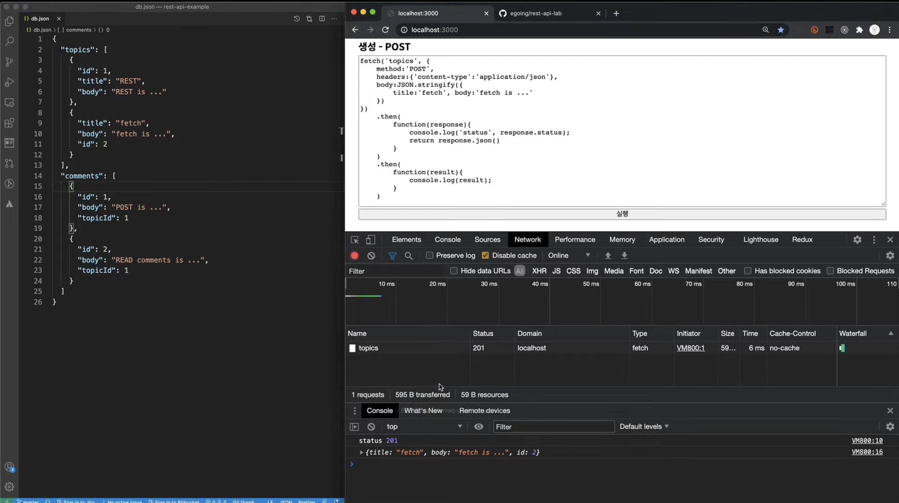

# REST_API
  > Representational State Transfer - Application Programming Interface
- HTTP에서 필요한 자원에 접근할 때 웹의 장점을 최대한 활용하기 위한 아키텍쳐
- 컴퓨터 상호간에 상호 운용성을 제공하는 방법 중 하나

## WEB

- Q : 어떻게 인터넷에서 정보를 공유할 것인가?
- A : 정보들을 하이퍼 텍스트로 연결한다.
  - 표현형식 : HTML
  - 식별자 : URI
  - 전송 방법 : HTTP

## REST란?

- 분산 하이퍼미디어 시스템(예: 웹)을 위한 아키텍쳐 스타일
- 아키텍쳐 스타일 : 제약조건의 집합

### REST를 구성하는 스타일
- client-server
- stateless
- cache
- **uniform interface**
  - identification of resources : 리소스가 URI로 식별 되는가?
  - manipulation of resources throurgh represntations : representations 전송을 통해 리소스를 조작해야함
  - **self-descriptive messages** : 메시지는 스스로를 설명해야함
  - **hypermedia as the engine of application state (HATEOAS)** : 애플리케이션의 상태는 hyperlink를 통해 전이되어야함

- layered system
- code-on-demand (optional) : 서버에서 코드를 클라이언트한테 보내서 실행이 가능해야함 (javascript)

#### 왜 Uniform Interface?
- 독립적 진화
  - 서버와 클라이언트가 각각 독립적으로 진화한다.
  - **서버의 기능이 변경되어도 클라이언트를 업데이트할 필요가 없다.**
  - REST를 만들게 된 계기 : "How do I improve HTTP without breaking the Web."

- 예시(웹)
  - 웹페이지(클라이언트) 변경됐다고 웹브라우저(서버) 업데이트 할 필요 없음
  - 웹브라우저(서버)를 업데이트했다고 웹페이지(클라이언트)를 변경할 필요 없음
  - HTTP 명세가 변경되어도 웹은 잘 작동한다.
  - HTML 명세가 변경되어도 웹은 잘 작동한다.

## REST가 웹에 도움을 주었는가?
- HTTP에 지속적으로 영향을 줌
- Host 헤더 추가
- 길이 제한을 다루는 방법이 명시
- URI에서 리소스의 정의가 추상적으로 변경됨 "식별하고자 하는 무언가"
- 기타 HTTP와 URI에 많은 영향을 줌
- HTTP/1.1 명세 최신 판에서 REST에 대한 언급이 들어감

## REST API는?

- REST API는 REST 아키텍쳐 스타일을 따라야한다.
- 오늘날 스스로 REST API라고 하는 API들의 대부분은 REST 아키텍쳐 스타일을 따르지 않는다.

### REST API가 어려운 이유

  - 
  - 

  - Self-descriptive
    - 방법 1. Media type
      > JSON 형태에서 기계는 key, value의 의미를 알 수 없음
      1. 미디어 타입을 하나 정의한다.
      2. 미디어 타입 문서를 작성한다. 이 문서에 "id"가 뭐고 "title"이 뭔지 의미를 정의한다.
      3. IANA에 미디어 타입을 등록한다. 이 때 만든 문서를 미디어 타입의 명세로 등록한다.
      4. 이제 이 메시지를 보는 사람은 명세를 찾아갈 수 있으므로 이 메시지의 의미를 온전히 해석할 수 있다.

    - **방법 2. Profile**
      - "key" : "value"가 뭔지 의미를 정의한 명세를 작성한다.
      - Link 헤더에 profile relation으로 해당 명세를 링크한다.
      - 이제 메시지를 보는 사람은 명세를 찾아갈 수 있으므로 이 문서의 의미를 온전히 해석할 수 있다.
  
  - HATEOAS
    - 방법 1. data
      - data에 다양한 방법으로 하이퍼링크를 표현한다.
      - JSON으로 하이퍼링크를 표현하는 방법을 정의한 명세들을 활용
        - JSON API
        - HAL
        - UBER
    
    - 방법 2. HTTP header
      - link, Location 등의 헤더로 링크를 표현

---

## 정리

- 오늘날 대부분 REST API는 사실 REST를 따르지 않음
- REST 제약 조건 중에서 특히 self-descriptive와 HATEOAS를 잘 만족하지 못함
- REST는 긴 시간에 걸쳐 진화하는 웹 애플리케이션을 위한 것
- REST를 따를 것인지 API 설계하는 이들이 스스로 판단해서 결정해야함
- 따르지 않으면 HTTP API가 맞음
---

## 구성요소

1. HTTP Method
  - GET : 조회
  - POST : 데이터 생성
  - PUT : 데이터 전체 수정
  - PATCH : 데이터 일부 수정
  - DELETE : 데이터 삭제

2. URL : 데이터 접근
 
3. Representation : 자원의 표현
 
## Resource

  - Resource

  - Request

---

  - REST Client 활용