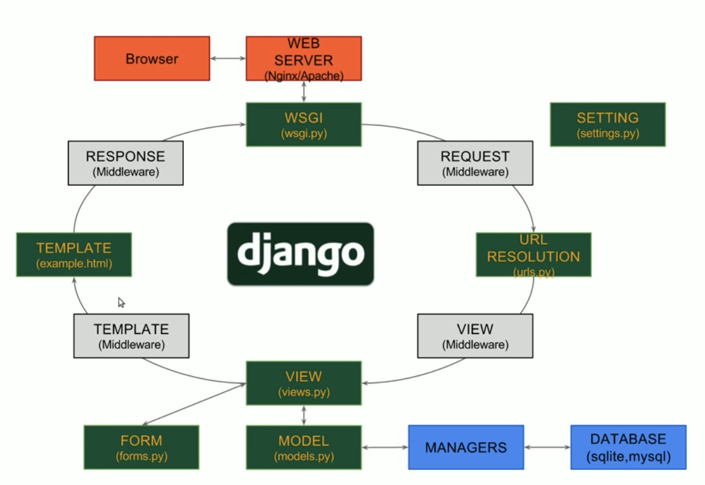

# Django

## django 구조



- apache - WSGI - Django - db
### 1. 가상환경 세팅

- 가상환경 설치
  - python -m venv venv : venv라는 이름의 가상환경 생성

- 가상환경 접근
  - source venv/bin/activate : 가상환경 실행
  - deactivate : 가상환경 종료

- 패키지 확인
  - pip list

### 2. django 설치

- 가상환경 접근

- pip install django

- django-admin startproject (프로젝트명) .
  - 현재 폴더에 (프로젝트명)의 폴더가 하나 생성됨

- python manage.py runserver 0:80 : (0) 나자신을 80포트로 서버 구동
  - URL/admin : admin
    > django는 풀스택 프레임워크로 필요한 모든 요소가 설치됨

- python manage.py startapp (이름)
  > django 홈페이지는 1개의 홈페이지가 여러개의 앱으로 구성되어있음

- python manage.py migrate : 내용 반영

## 3. djanog app 생성

- python manage.py startapp main

- setting.py
  - INSTALED_APPS 앱 이름 추가

## 4. URL

- URL 연동 : 아래 3가지가 모두 연동되어야함
  - 프로젝트폴더/urls.py/urlpatterns
  - 앱폴더/views.py/ 함수
  - 앱폴더/templates

- URL 생성
  - 프로젝트/urls.py
    - urls.py
    - from main.views import index
    - urlpatterns 
      - [ path('', index), ]
        > ''로 접속하면 index로 연결해줌
  > urlpattern과 import 매칭 시켜줘야함

- python manage.py runserver 0:80

## 5. templates

- main/views.py : 사용자에게 어떤화면을 전달할지
``` python
  def index(request):
    return render(request, 'index.html') 
```

## 6. 요청 응답 처리

- views.py
  > return값에 알맞는 함수를 넣어보며 공부
  - render
    - HttpResponse를 return해주는 함수

  - redirect
    - 페이지 이동시켜주는 함수
  
  - HttpResponse
    - 괄호 안에 스트링을 전송해줌

- main/templates 폴더 생성
  - index.html 생성

- python manage.py runsever로 확인

## 7. static file과 settings

- ht 

## template language

1. 템플릿 태그
    - 템플릿 태그는 기존 Python에 있는 syntax에 해당하는 부분으로 if, else, for 구문을 사용할 수 있고 추가로 extend, block, include, etc를 사용할 수 있음

``` html

```

2. 템플릿 변수
    - 템플릿 변수는 render 함수나 JsonResponse 함수로 데이터를 전달 받아 html파일 안에서 호출되는 dictionary형 변수

``` html
{{ 변수 }}
```

3. 템플릿 필터
    - 템플릿 필터는 변수값을 변환시켜 출력하기 위한 출력하기 위한 옵션

``` html
{{ 변수|옵션 }}
```
---

## 사용 명령어 정리

- python
  - -V : 버전 체크
  - -m venv (이름) : (이름)의 가상환경을 만듬
  - manage.py 
    - runserver IP주소:포트
    - startapp 앱이름
    - migrate

- source
  - (activate의 경로)

- pip
  - list : 설치된 pip 패키지
  - install django==버전

- django-admin
  - startproject 프로젝트명 .

## django 변수

### project 폴더

- settings.py
  - BASE_DIR : 경로
  - DEBUG
    - TRUE (오류 내용 보여줌)
    - FALSE (오류 내용 안보여줌)
      > 일반적으로 FALSE
  - ALLOWED_HOSTS : 접속 가능한 사람 (white list)
  - INSTALLED_APPS : 이미 구현된 앱
    - 라이브러리를 앱 형태로 제공 되거나 직접 만듬
  - MIDDLEWARE : 보안과 관련된 것들이 주로 제공
  - ROOT_URLCONF : 프로젝트 안에 urls.py를 가르킴
  - TEMPLATES
  - WCGI_APPLICATION
  - DATABASES : 데이터베이스 설정
    - default는 sqlite3
  - AUTH_PASSWORD_VALIDATORS : 유효성 검사
  - LANGGUAGE_CODE : 언어
    - 'ko-kr'
  - TIME_ZONE : 시간
    - 'Asia/Seoul'
  - USE_I18N : 국제화
  - USE_L10N : 현지화
  - STATIC_URL : 정적파일을 서빙할 URL 구조
  - STATICFILES_DIRS : 어떤폴더에 모여있게 할지

- urls.py
  - from 앱이름.views import index
  - urlpatterns : 주소
    - [ path('주소', index), ]
  > urlpattern과 import 매칭 시켜줘야함

### app 폴더
  > 일반적으로 templates 폴더를 하나 더 만듬

- templates
- models.py : 저장공간(db)

- views.py : 사용자에게 어떤화면을 전달할지
``` python
  def index(request):
    return render(request, 'index.html') 
```
- urls.py

### model

- db 생성
  - python manage.py migrations
    - db 생성
  - python manage.py migrate
    - db 반영

- 데이터 넣기
  - admin 사이트
  - 데이터 시딩 -> 한번에
  - 쉘창
ㄴ
---
CSRF 해킹공격 
ORM 기법
ERD