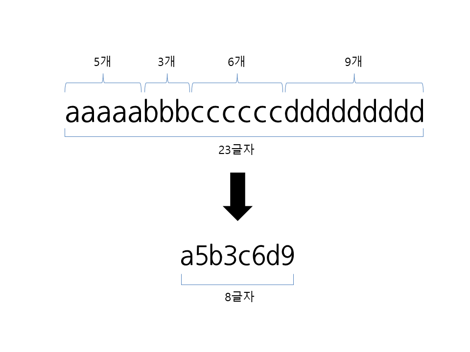
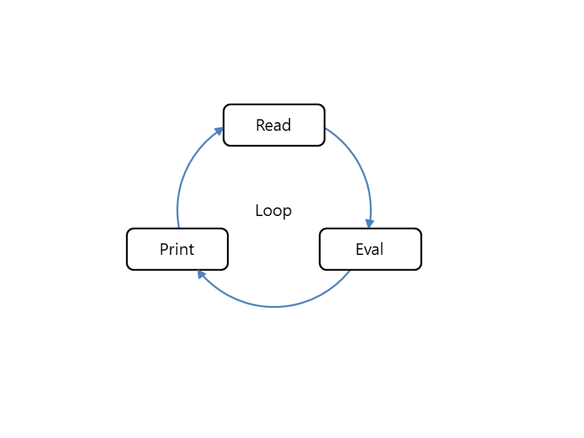
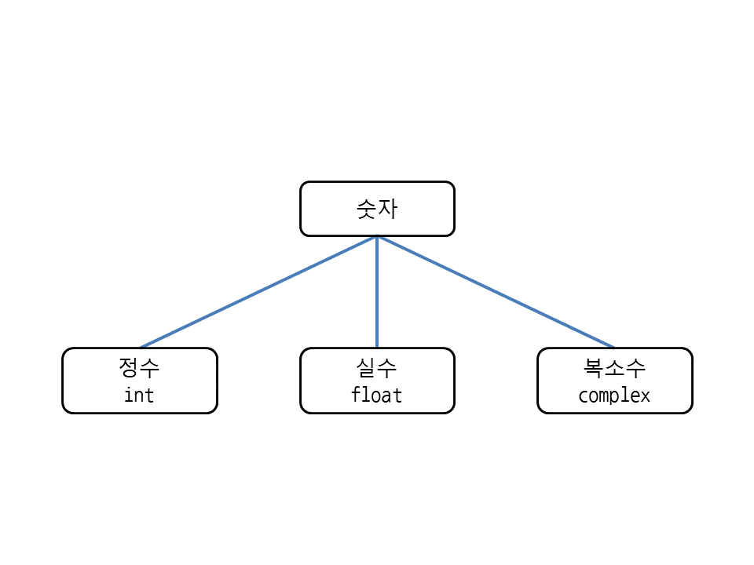

# 파이썬 문법

## algorithm
  > 문제에서 일정한 패턴을 발견하고, 패턴을 토대로 문제를 해결하는 절차



## interacive shell
  > interpreter : C 언어

- interactive mode : 인터프리터와 대화하듯 코드를 처리



## 숫자 자료형

- 강제 전환 : int, float, complex
  - int(숫자)
  - int(계산식)
  - int('문자열')

 

- 거듭제곱 : **

### 나눗셈 

- 나눗셈
  - / : 정수 / 정수 = 실수
  - // : 정수 // 정수 = 정수
    > floor division

- divmod (quotient, remainder) : 몫과 나머지 함께 구하기
  - 몫과 나머지가 튜플 형태로 나옴

- type() : 자료형 알아내기
  - type(숫자)
  - type(계산식)
  - type('문자열')

### 진수표현 base, decimal

- 2진수 : 0b (binary)
- 8진수 : 0o (october)
- 16진수 : 0x (hexa)

### 실수 계산
  > 실수값은 오차가 있음

## 변수

``` python
  # 기본 할당
  x = 10

  # 빈 변수
  x = none

  # 순차적 할당
  x, y = 10, 20
 
  # 마지막 10을 x,y,z에 할당
  x = y = z = 10
```

- del 변수 : 변수 삭제

- 할당과 동시에 연산
  - -=
  - +=
  - *=
  - /=

- 입력값 변수 저장
  - input()

---

## Built_function

- List
  - append : 리스트 끝에 원소 추가(변수 자체를 넣음(리스트 안에 리스트도 가능))
  - extend : 리스트 끝에 모든 원소 추가(iterable의 각 항목을 넣음)
    > [append vs extend](https://m.blog.naver.com/wideeyed/221541104629)

  - copy : 원본에 영향을 주지않기 위해 사용
  - clear : 리스트 안에 원소 모두 삭제
    > copy(deep copy)를 한 함수는 사라지지않음

  - count(a) : 리스트 안에 원소 a의 갯수 반환
  - index : 리스트 값의 위치를 반환

  - insert(a,b) : 리스트의 a위치에 b원소 삽입
  
  - pop : 리스트의 지정한 위치에 원소 삭제(위치를 지정)
  - remove : 리스트에 들어있는 원소 삭제(원소를 지정)

- format()
  - format(value, format_spec)
  - 형식 지정자가 제어하는 주어진 값의 형식화 된 표현을 출력

- filter(functiom, iterable)
  - iterable의 각 요소가 tru인지 아닌지 확인후 출력

- Map(function, iterable, ...)
  - 주어진 function을 iterable의 각 항목에 적용하고 결과 목록을 출력


---


### 1. Comprehension

- List Comprehension

    ```python
    [expression for item in list]
    ```

- Set Comprehension
- Dict Comprehension
- Generator Expression

> https://codechacha.com/ko/python-comprehension/


