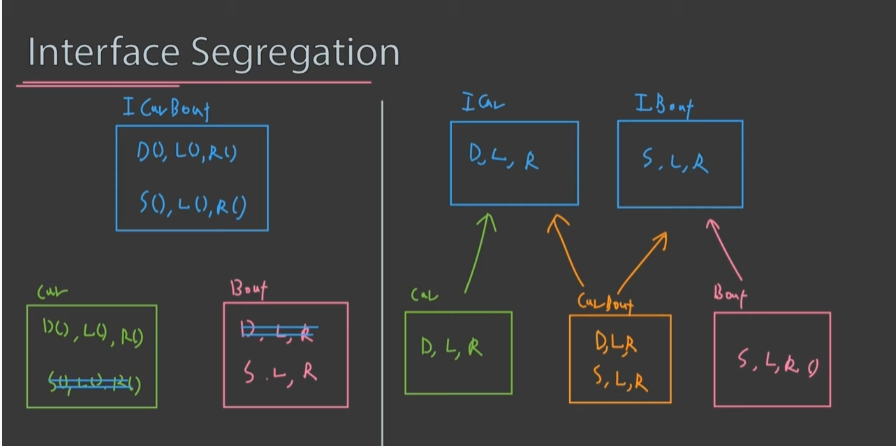

# SOLID 패턴

## Single Responsibility(단일 책임 원칙)

- 한 객체는 한가지의 책임만 있어야함

``` python
def add(num1, num2):
    return num1 + num2

def numPrint(num):
    print(num)

def addPrint(num1, num2):
    num = num1 + num2
    print(num)
    return num
```

- add 함수, numPrint 함수는 단일 책임 원칙을 지켰음
- 코드를 줄인다고 addPrint로 묶으면 단일 책임 원칙에 위배됨

``` python
class Cat:
    def __init__(self, age, name):
        self.age = age
        self.name = name

    def eat(self, food):
        pass
    
    def walk(self):
        pass
    
    def speak(self):
        pass

    # def print(self):
    #     print(f"age:{self.age} name:{self.name}")

    # def log(self, logger):
    #     logger.log(f"age:{self.age} name:{self.name}")
    #     logger.log(datetime.now())

    def repr(self):
        return f"age:{self.age} name:{self.name}"

kitty = Cat()
print(kitty.repr())
logger.log(kitty.repr())
```

- 고양이 고유의 기능이 아닌 print, log등은 삭제하고 밖으로 빼줌으로 단일책임원칙을 지킴


## Open-Closed Principle(개방 폐쇄 원칙)

- 확장에 대해서는 개방, 수정에 대해서는 폐쇄

``` python
def Animal:
    def __init__(self.a_type):
        self.a_type = a_type

def hey(animal:Animal):
    if animal.a_type == 'Cat':
        print('meow')
    elif animal.a_type == 'Dog':
        print('bark')
    else:
        raise Error('wrong a_type')
```

- 위 코드는 고양이, 개가 아닌 다른 동물을 추가하려면 '수정'이 필요함

```python
class Animal:
    def speak(self):
        pass

class Cat(Animal):
    def speak(self):
        print('meow')

class Dog(Animal):
    def speak(self):
        print('bark')

def hey(animal:Animal):
    animal.speak()
```

- hey 함수 수정 없이 밖에서 확장 가능함

## Liskov Substitution Principle (리스코프 치환 법칙)

- type T가 있고, subtype s1, s2, s3가 있을때 type T는 subtype과 치환해도 가능해야함

> ex) 고양이(T) / 검은고양이(s1), 하얀고양이(s2)

``` python
class Cat:
    def speak(self):
        print("meow")

class BlackCat(Cat):
    def speak(self):
        print("black meow")

def speak(cat:Cat):
    cat.speak()

# class Fish(Cat):
#     def speak(self):
#         raise Exception("Fish cannot speak")

```

- 전체적인 클래스 구조를 만들때 고양이, 피쉬를 제대로 생각하고 만들거나, 문제가 생기지 않게 또다른 방법을 사용하여야함

## Interface segregation principle

- 인터페이스를 너무 크게 잡지 말 것
  - 너무 크게 잡을시 사용하지않을 메소드가 들어감
    - 수륙양용차 -> 차 + 보트로 나눔


