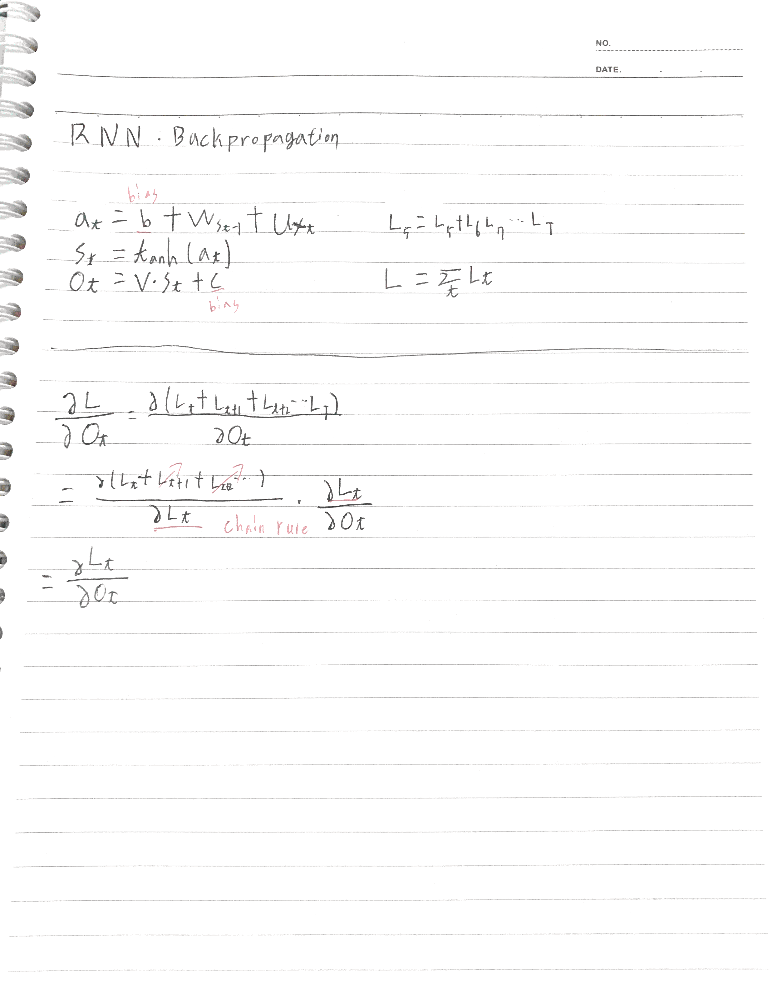

# math

## Everage

---

## Partial Deriviate

---

## Gradient Descent, chain rule

## Backpropagation

- 내가 원하는 taget값과 model이 계산한 output 값이 얼마나 차이가 있는지 계산한 후, 오차 값을 다시 뒤로 전파해가면서 Node가 가지고 있는 Weight값을 업데이트 하는 과정

---

