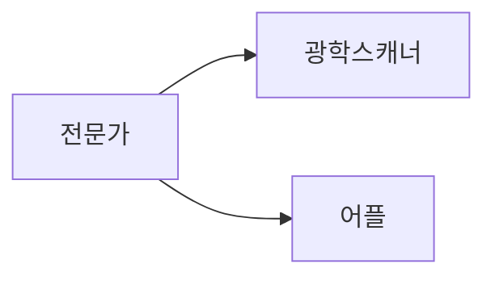

# The Batch

### Article 1 - Fighting Addiction or Denying Care?

1. 마약성 진통제(헤로인)

끊는게 답이 아님

---

### Article 2 - Weak Foundations Make Weak Models

---
### Article 3 - Wake Up and Smell the AI

- 커피 회사들이 머신러닝을 활용하여 더 나은 커피를 재배(Nespresso - Demetria)

- 방식 
    - 묘목을 접목하여 새로운 커피를 개발
    - 

### Article 4 - More Reliable Pretraining

[DeepLearning](https://read.deeplearning.ai/the-batch/issue-106/)