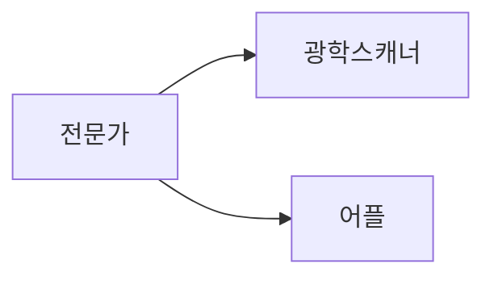

# The Batch

### Article 1 - Fighting Addiction or Denying Care?

- 마약성 진통제(헤로인) 남용문제
- 치료를 거부당하는 환자가 생김
- 약물 처방 추적 시스템 개발(NarxCare)
- 무조건 끊는 것이 아니라 AI로 의사에게 환자 개인별 약물점수를 주어 판단에 도움을 주자

---

### Article 2 - Weak Foundations Make Weak Models

---
### Article 3 - Wake Up and Smell the AI

- 커피 회사들이 머신러닝을 활용하여 더 나은 커피를 재배(Nespresso - Demetria)

- 방식 
    - 묘목을 접목하여 새로운 커피를 개발

### Article 4 - More Reliable Pretraining

[DeepLearning](https://read.deeplearning.ai/the-batch/issue-106/)